# Plan de Migración Completa - BusCot a VPS con Nginx Proxy Manager

## 🎯 Configuración Específica

- **Proyecto**: BusCot
- **Dominio**: buscot.aware.doctor
- **Ubicación**: /opt/proyectos/buscot/
- **Red existente**: npm_default (Nginx Proxy Manager)
- **Contenedor NPM**: npm

## 📊 Arquitectura con NPM

```mermaid
graph TB
    Internet[Internet :80/:443] --> NPM[Nginx Proxy Manager<br/>Contenedor: npm<br/>Red: npm_default]
    
    NPM -->|buscot.aware.doctor| Frontend[Frontend Container<br/>buscot-frontend<br/>Puerto interno: 80]
    NPM -->|buscot.aware.doctor/api| SupaAPI[Supabase API Gateway<br/>Puerto interno: 8000]
    
    subgraph "Red npm_default"
        NPM
        Frontend
    end
    
    subgraph "Red buscot_network"
        SupaAPI --> Kong[Kong Gateway]
        SupaAPI --> Auth[GoTrue Auth]
        SupaAPI --> Realtime[Realtime Server]
        SupaAPI --> Storage[Storage API]
        SupaAPI --> Functions[Edge Functions]
        
        Auth --> Postgres[(PostgreSQL 15)]
        Storage --> Postgres
        Functions --> Postgres
        Realtime --> Postgres
    end
    
    Frontend -.conexión bridge.-> Kong
    
    Functions --> HuggingFace[Hugging Face API]
    Functions --> Resend[Resend Email API]
    Functions --> Turnstile[Cloudflare Turnstile]
```



## 📁 Paso 1: Estructura de Archivos para GitHub

### 1.1. Dockerfile para Frontend

**Ubicación**: `/Dockerfile` (raíz del proyecto)

```dockerfile
# =====================================
# DOCKERFILE - BUSCOT FRONTEND
# =====================================
# Build stage
FROM node:18-alpine AS builder

WORKDIR /app

# Copiar package files
COPY package*.json ./
RUN npm ci --only=production

# Copiar código fuente
COPY . .

# Build arguments para variables de entorno
ARG VITE_SUPABASE_URL
ARG VITE_SUPABASE_ANON_KEY

ENV VITE_SUPABASE_URL=$VITE_SUPABASE_URL
ENV VITE_SUPABASE_ANON_KEY=$VITE_SUPABASE_ANON_KEY

# Build de producción
RUN npm run build

# =====================================
# Production stage
FROM nginx:alpine

# Copiar build
COPY --from=builder /app/dist /usr/share/nginx/html

# Copiar configuración de nginx
COPY nginx.conf /etc/nginx/conf.d/default.conf

# Health check
HEALTHCHECK --interval=30s --timeout=3s --start-period=5s --retries=3 \
  CMD wget --no-verbose --tries=1 --spider http://localhost/ || exit 1

EXPOSE 80

CMD ["nginx", "-g", "daemon off;"]
```

### 1.2. Configuración Nginx para el Contenedor

**Ubicación**: `/nginx.conf` (raíz del proyecto)

```nginx
server {
    listen 80;
    server_name _;
    root /usr/share/nginx/html;
    index index.html;
    
    # Servir archivos estáticos con fallback a index.html (SPA)
    location / {
        try_files $uri $uri/ /index.html;
    }
    
    # Configuración de compresión
    gzip on;
    gzip_vary on;
    gzip_min_length 1024;
    gzip_proxied any;
    gzip_comp_level 6;
    gzip_types 
        text/plain 
        text/css 
        text/xml 
        text/javascript 
        application/javascript 
        application/xml+rss 
        application/json
        image/svg+xml;
    
    # Cache para assets estáticos
    location ~* \.(jpg|jpeg|png|gif|ico|css|js|svg|woff|woff2|ttf|eot)$ {
        expires 1y;
        add_header Cache-Control "public, immutable";
        access_log off;
    }
    
    # Deshabilitar cache para index.html
    location = /index.html {
        add_header Cache-Control "no-cache, no-store, must-revalidate";
        expires 0;
    }
    
    # Security headers
    add_header X-Frame-Options "SAMEORIGIN" always;
    add_header X-Content-Type-Options "nosniff" always;
    add_header X-XSS-Protection "1; mode=block" always;
    add_header Referrer-Policy "strict-origin-when-cross-origin" always;
}
```

### 1.3. Docker Compose Principal

**Ubicación**: `/docker-compose.yml` (raíz del proyecto)

```yaml
version: '3.8'

# =====================================================
# BUSCOT - DOCKER COMPOSE CONFIGURATION
# =====================================================
# Este archivo configura todos los servicios necesarios
# para ejecutar BusCot con Supabase local
# =====================================================

networks:
  # Red interna para servicios de Supabase
  buscot_network:
    driver: bridge
  # Red externa de Nginx Proxy Manager (debe existir previamente)
  npm_default:
    external: true

volumes:
  buscot_db_data:
    driver: local
  buscot_storage_data:
    driver: local

services:
  # =====================================
  # FRONTEND - React + Vite
  # =====================================
  frontend:
    build:
      context: .
      dockerfile: Dockerfile
      args:
        VITE_SUPABASE_URL: ${VITE_SUPABASE_URL}
        VITE_SUPABASE_ANON_KEY: ${VITE_SUPABASE_ANON_KEY}
    container_name: buscot-frontend
    restart: unless-stopped
    networks:
      - npm_default
      - buscot_network
    depends_on:
      kong:
        condition: service_started
    healthcheck:
      test: ["CMD", "wget", "--no-verbose", "--tries=1", "--spider", "http://localhost/"]
      interval: 30s
      timeout: 10s
      retries: 3

  # =====================================
  # SUPABASE - KONG API GATEWAY
  # =====================================
  kong:
    image: kong:2.8-alpine
    container_name: buscot-kong
    restart: unless-stopped
    environment:
      KONG_DATABASE: "off"
      KONG_DECLARATIVE_CONFIG: /usr/local/kong/kong.yml
      KONG_DNS_ORDER: LAST,A,CNAME
      KONG_PLUGINS: request-transformer,cors,key-auth,rate-limiting
      KONG_NGINX_PROXY_PROXY_BUFFER_SIZE: 160k
      KONG_NGINX_PROXY_PROXY_BUFFERS: 64 160k
    volumes:
      - ./supabase/config/kong.yml:/usr/local/kong/kong.yml:ro
    networks:
      - npm_default
      - buscot_network
    depends_on:
      db:
        condition: service_healthy
      auth:
        condition: service_started
      rest:
        condition: service_started

  # =====================================
  # SUPABASE - POSTGRESQL DATABASE
  # =====================================
  db:
    image: supabase/postgres:15.1.1.78
    container_name: buscot-db
    restart: unless-stopped
    ports:
      - "54322:5432"  # Exponer para acceso externo si es necesario
    environment:
      POSTGRES_HOST: /var/run/postgresql
      POSTGRES_PASSWORD: ${POSTGRES_PASSWORD}
      POSTGRES_DB: postgres
      POSTGRES_INITDB_ARGS: "--encoding=UTF8 --locale=en_US.UTF-8"
    volumes:
      - buscot_db_data:/var/lib/postgresql/data
      - ./DATABASE_EXPORT.sql:/docker-entrypoint-initdb.d/01-init.sql:ro
    networks:
      - buscot_network
    command:
      - postgres
      - -c
      - config_file=/etc/postgresql/postgresql.conf
      - -c
      - log_min_messages=fatal
    healthcheck:
      test: ["CMD-SHELL", "pg_isready -U postgres -h localhost"]
      interval: 10s
      timeout: 5s
      retries: 5

  # =====================================
  # SUPABASE - AUTH (GoTrue)
  # =====================================
  auth:
    image: supabase/gotrue:v2.151.0
    container_name: buscot-auth
    restart: unless-stopped
    environment:
      GOTRUE_API_HOST: 0.0.0.0
      GOTRUE_API_PORT: 9999
      API_EXTERNAL_URL: ${SITE_URL}
      
      GOTRUE_DB_DRIVER: postgres
      GOTRUE_DB_DATABASE_URL: postgres://supabase_auth_admin:${POSTGRES_PASSWORD}@db:5432/postgres?search_path=auth
      
      GOTRUE_SITE_URL: ${SITE_URL}
      GOTRUE_URI_ALLOW_LIST: ${SITE_URL}
      GOTRUE_DISABLE_SIGNUP: false
      
      GOTRUE_JWT_ADMIN_ROLES: admin
      GOTRUE_JWT_AUD: authenticated
      GOTRUE_JWT_DEFAULT_GROUP_NAME: authenticated
      GOTRUE_JWT_EXP: 3600
      GOTRUE_JWT_SECRET: ${JWT_SECRET}
      
      GOTRUE_EXTERNAL_EMAIL_ENABLED: true
      GOTRUE_MAILER_AUTOCONFIRM: false
      GOTRUE_SMTP_ADMIN_EMAIL: ${SMTP_ADMIN_EMAIL}
      GOTRUE_SMTP_HOST: ${SMTP_HOST}
      GOTRUE_SMTP_PORT: ${SMTP_PORT}
      GOTRUE_SMTP_USER: ${SMTP_USER}
      GOTRUE_SMTP_PASS: ${SMTP_PASS}
      GOTRUE_SMTP_SENDER_NAME: ${SMTP_SENDER_NAME}
      
      GOTRUE_MAILER_URLPATHS_INVITE: /auth/v1/verify
      GOTRUE_MAILER_URLPATHS_CONFIRMATION: /auth/v1/verify
      GOTRUE_MAILER_URLPATHS_RECOVERY: /auth/v1/verify
      GOTRUE_MAILER_URLPATHS_EMAIL_CHANGE: /auth/v1/verify
    networks:
      - buscot_network
    depends_on:
      db:
        condition: service_healthy

  # =====================================
  # SUPABASE - REALTIME
  # =====================================
  realtime:
    image: supabase/realtime:v2.28.32
    container_name: buscot-realtime
    restart: unless-stopped
    environment:
      DB_HOST: db
      DB_PORT: 5432
      DB_USER: supabase_admin
      DB_PASSWORD: ${POSTGRES_PASSWORD}
      DB_NAME: postgres
      DB_AFTER_CONNECT_QUERY: 'SET search_path TO realtime'
      PORT: 4000
      JWT_SECRET: ${JWT_SECRET}
      REPLICATION_MODE: RLS
      REPLICATION_POLL_INTERVAL: 100
      SECURE_CHANNELS: true
      SLOT_NAME: supabase_realtime_rls
      TEMPORARY_SLOT: true
    networks:
      - buscot_network
    depends_on:
      db:
        condition: service_healthy

  # =====================================
  # SUPABASE - REST API (PostgREST)
  # =====================================
  rest:
    image: postgrest/postgrest:v12.0.1
    container_name: buscot-rest
    restart: unless-stopped
    environment:
      PGRST_DB_URI: postgres://authenticator:${POSTGRES_PASSWORD}@db:5432/postgres
      PGRST_DB_SCHEMAS: public,storage,graphql_public
      PGRST_DB_ANON_ROLE: anon
      PGRST_JWT_SECRET: ${JWT_SECRET}
      PGRST_DB_USE_LEGACY_GUCS: false
      PGRST_APP_SETTINGS_JWT_SECRET: ${JWT_SECRET}
      PGRST_APP_SETTINGS_JWT_EXP: 3600
    networks:
      - buscot_network
    depends_on:
      db:
        condition: service_healthy

  # =====================================
  # SUPABASE - STORAGE
  # =====================================
  storage:
    image: supabase/storage-api:v1.0.6
    container_name: buscot-storage
    restart: unless-stopped
    environment:
      ANON_KEY: ${SUPABASE_ANON_KEY}
      SERVICE_KEY: ${SUPABASE_SERVICE_ROLE_KEY}
      POSTGREST_URL: http://rest:3000
      PGRST_JWT_SECRET: ${JWT_SECRET}
      DATABASE_URL: postgres://supabase_storage_admin:${POSTGRES_PASSWORD}@db:5432/postgres
      FILE_SIZE_LIMIT: 52428800
      STORAGE_BACKEND: file
      FILE_STORAGE_BACKEND_PATH: /var/lib/storage
      TENANT_ID: stub
      REGION: stub
      GLOBAL_S3_BUCKET: stub
    volumes:
      - buscot_storage_data:/var/lib/storage:z
    networks:
      - buscot_network
    depends_on:
      db:
        condition: service_healthy
      rest:
        condition: service_started

  # =====================================
  # SUPABASE - EDGE FUNCTIONS (Deno)
  # =====================================
  functions:
    image: supabase/edge-runtime:v1.45.2
    container_name: buscot-functions
    restart: unless-stopped
    environment:
      JWT_SECRET: ${JWT_SECRET}
      SUPABASE_URL: http://kong:8000
      SUPABASE_ANON_KEY: ${SUPABASE_ANON_KEY}
      SUPABASE_SERVICE_ROLE_KEY: ${SUPABASE_SERVICE_ROLE_KEY}
      SUPABASE_DB_URL: postgresql://postgres:${POSTGRES_PASSWORD}@db:5432/postgres
      
      # Secretos de APIs externas
      HUGGINGFACE_API_TOKEN: ${HUGGINGFACE_API_TOKEN}
      RESEND_API_KEY: ${RESEND_API_KEY}
      TURNSTILE_SECRET: ${TURNSTILE_SECRET}
      ALLOWED_PROMOTION_EMAILS: ${ALLOWED_PROMOTION_EMAILS}
      
      # Configuración de Deno
      DENO_DEPLOYMENT_ID: local
      VERIFY_JWT: false
    volumes:
      - ./supabase/functions:/home/deno/functions:ro
    networks:
      - buscot_network
    depends_on:
      db:
        condition: service_healthy

  # =====================================
  # SUPABASE - STUDIO (Interfaz Web)
  # =====================================
  studio:
    image: supabase/studio:20240729-ce2d7b6
    container_name: buscot-studio
    restart: unless-stopped
    ports:
      - "54323:3000"
    environment:
      STUDIO_PG_META_URL: http://meta:8080
      POSTGRES_PASSWORD: ${POSTGRES_PASSWORD}
      
      DEFAULT_ORGANIZATION_NAME: BusCot
      DEFAULT_PROJECT_NAME: BusCot Medical Assistant
      
      SUPABASE_URL: http://kong:8000
      SUPABASE_PUBLIC_URL: ${SITE_URL}
      SUPABASE_ANON_KEY: ${SUPABASE_ANON_KEY}
      SUPABASE_SERVICE_KEY: ${SUPABASE_SERVICE_ROLE_KEY}
    networks:
      - buscot_network

  # =====================================
  # SUPABASE - META (API de metadatos)
  # =====================================
  meta:
    image: supabase/postgres-meta:v0.80.0
    container_name: buscot-meta
    restart: unless-stopped
    environment:
      PG_META_PORT: 8080
      PG_META_DB_HOST: db
      PG_META_DB_PORT: 5432
      PG_META_DB_NAME: postgres
      PG_META_DB_USER: supabase_admin
      PG_META_DB_PASSWORD: ${POSTGRES_PASSWORD}
    networks:
      - buscot_network
    depends_on:
      db:
        condition: service_healthy
```

### 1.4. Archivo de Configuración Kong

**Ubicación**: `/supabase/config/kong.yml`

```yaml
_format_version: "1.1"

# =====================================
# KONG API GATEWAY CONFIGURATION
# =====================================

services:
  - name: auth-v1-open
    url: http://auth:9999/verify
    routes:
      - name: auth-v1-open
        strip_path: true
        paths:
          - /auth/v1/verify
    plugins:
      - name: cors

  - name: auth-v1-open-callback
    url: http://auth:9999/callback
    routes:
      - name: auth-v1-open-callback
        strip_path: true
        paths:
          - /auth/v1/callback
    plugins:
      - name: cors

  - name: auth-v1-open-authorize
    url: http://auth:9999/authorize
    routes:
      - name: auth-v1-open-authorize
        strip_path: true
        paths:
          - /auth/v1/authorize
    plugins:
      - name: cors

  - name: auth-v1
    _comment: "GoTrue: /auth/v1/* -> http://auth:9999/*"
    url: http://auth:9999/
    routes:
      - name: auth-v1-all
        strip_path: true
        paths:
          - /auth/v1/
    plugins:
      - name: cors

  - name: rest-v1
    _comment: "PostgREST: /rest/v1/* -> http://rest:3000/*"
    url: http://rest:3000/
    routes:
      - name: rest-v1-all
        strip_path: true
        paths:
          - /rest/v1/
    plugins:
      - name: cors

  - name: realtime-v1
    _comment: "Realtime: /realtime/v1/* -> ws://realtime:4000/socket/*"
    url: http://realtime:4000/socket
    routes:
      - name: realtime-v1-all
        strip_path: true
        paths:
          - /realtime/v1/
    plugins:
      - name: cors

  - name: storage-v1
    _comment: "Storage: /storage/v1/* -> http://storage:5000/*"
    url: http://storage:5000/
    routes:
      - name: storage-v1-all
        strip_path: true
        paths:
          - /storage/v1/
    plugins:
      - name: cors

  - name: functions-v1
    _comment: "Edge Functions: /functions/v1/* -> http://functions:9000/*"
    url: http://functions:9000/
    routes:
      - name: functions-v1-all
        strip_path: true
        paths:
          - /functions/v1/
    plugins:
      - name: cors

## Global Plugins
plugins:
  - name: cors
    config:
      origins:
        - "*"
      methods:
        - GET
        - HEAD
        - PUT
        - PATCH
        - POST
        - DELETE
        - OPTIONS
      headers:
        - Accept
        - Accept-Version
        - Content-Length
        - Content-MD5
        - Content-Type
        - Date
        - Authorization
        - X-Client-Info
        - apikey
        - X-Supabase-Auth
      exposed_headers:
        - X-Supabase-Api-Version
      credentials: true
      max_age: 3600
```

### 1.5. Actualizar Cliente Supabase

**Ubicación**: `/src/integrations/supabase/client.ts`

```typescript
// This file is automatically generated. Do not edit it directly.
import { createClient } from '@supabase/supabase-js';
import type { Database } from './types';

// Usar variables de entorno en build time
const SUPABASE_URL = import.meta.env.VITE_SUPABASE_URL || "http://localhost:54321";
const SUPABASE_PUBLISHABLE_KEY = import.meta.env.VITE_SUPABASE_ANON_KEY || "";

if (!SUPABASE_PUBLISHABLE_KEY) {
  console.error('❌ VITE_SUPABASE_ANON_KEY no está configurada');
}

export const supabase = createClient<Database>(SUPABASE_URL, SUPABASE_PUBLISHABLE_KEY, {
  auth: {
    storage: localStorage,
    persistSession: true,
    autoRefreshToken: true,
    detectSessionInUrl: true,
  },
  global: {
    headers: {
      'X-Client-Info': 'buscot-web-client',
    },
  },
});
```

### 1.6. Archivo de Variables de Entorno

**Ubicación**: `/.env.example`

```bash
# =====================================================
# BUSCOT - ENVIRONMENT VARIABLES
# =====================================================
# Copiar este archivo a .env y completar con tus valores
# =====================================================

# =====================================
# POSTGRESQL
# =====================================
POSTGRES_PASSWORD=tu-password-super-seguro-cambiar-esto

# =====================================
# JWT & SUPABASE KEYS
# =====================================
# Generar con: openssl rand -base64 64 | tr -d '\n'
JWT_SECRET=

# Generar con: openssl rand -base64 32 | tr -d '\n'
SUPABASE_ANON_KEY=
SUPABASE_SERVICE_ROLE_KEY=

# =====================================
# SITE CONFIGURATION
# =====================================
SITE_URL=https://buscot.aware.doctor

# Para build del frontend
VITE_SUPABASE_URL=https://buscot.aware.doctor/api
VITE_SUPABASE_ANON_KEY=${SUPABASE_ANON_KEY}

# =====================================
# SMTP CONFIGURATION (para emails)
# =====================================
SMTP_ADMIN_EMAIL=noreply@aware.doctor
SMTP_HOST=smtp.resend.com
SMTP_PORT=587
SMTP_USER=resend
SMTP_PASS=${RESEND_API_KEY}
SMTP_SENDER_NAME=BusCot Medical Assistant

# =====================================
# EXTERNAL APIs
# =====================================
HUGGINGFACE_API_TOKEN=
RESEND_API_KEY=
TURNSTILE_SECRET=
ALLOWED_PROMOTION_EMAILS=admin@aware.doctor,usuario@ejemplo.com
```

### 1.7. Actualizar .gitignore

**Ubicación**: `/.gitignore`

Agregar estas líneas:

```gitignore
# Docker & Environment
.env
.env.local
.env.production
docker-compose.override.yml

# Supabase local
.supabase/

# Backups
backups/
*.sql.gz
*.tar.gz

# Logs
*.log
logs/
```

### 1.8. Crear .dockerignore

**Ubicación**: `/.dockerignore`

```
# Dependencies
node_modules
npm-debug.log
package-lock.json
bun.lockb

# Build artifacts
dist
.vite
.cache

# Environment
.env
.env.*

# Git
.git
.gitignore
.gitattributes

# Documentation
*.md
docs/
ADMIN_MODULE_SETUP.md
API_DOCUMENTATION.md
AUTOMATION_SCRIPTS.md
AWARE_DOCTOR_IA_IMPROVEMENTS.md
DATA_MIGRATION_GUIDE.md
EXPORT_KIT_README.md
MEDICAL_SUMMARY_SETUP.md
PROMPT_FUNCIONAL.md
SECURITY_FIXES_IMPLEMENTED.md
SECURITY_MIGRATION.md
SECURITY_UPDATES_LOG.md
TROUBLESHOOTING.md
DEPLOYMENT_GUIDE.md
QUICK_START.md

# Docker
Dockerfile
docker-compose*.yml
.dockerignore

# IDE
.vscode
.idea
*.swp
*.swo
*~

# Testing
coverage/
.nyc_output/

# Temp files
temp-aspire.zip
*.tmp
```

### 1.9. Scripts de Utilidad

**Ubicación**: `/scripts/generate-keys.sh`

```bash
#!/bin/bash

# =====================================================
# SCRIPT DE GENERACIÓN DE CLAVES - BUSCOT
# =====================================================

set -e

echo "🔐 Generando claves de seguridad para BusCot..."
echo ""

# Generar claves
JWT_SECRET=$(openssl rand -base64 64 | tr -d '\n')
ANON_KEY=$(openssl rand -base64 32 | tr -d '\n')
SERVICE_ROLE_KEY=$(openssl rand -base64 32 | tr -d '\n')
POSTGRES_PASSWORD=$(openssl rand -base64 32 | tr -d '\n')

# Crear archivo .env
cat > .env << EOF
# =====================================================
# BUSCOT - ENVIRONMENT VARIABLES
# =====================================================
# Generado automáticamente: $(date)
# =====================================================

# POSTGRESQL
POSTGRES_PASSWORD=${POSTGRES_PASSWORD}

# JWT & SUPABASE KEYS
JWT_SECRET=${JWT_SECRET}
SUPABASE_ANON_KEY=${ANON_KEY}
SUPABASE_SERVICE_ROLE_KEY=${SERVICE_ROLE_KEY}

# SITE CONFIGURATION
SITE_URL=https://buscot.aware.doctor
VITE_SUPABASE_URL=https://buscot.aware.doctor/api
VITE_SUPABASE_ANON_KEY=${ANON_KEY}

# SMTP CONFIGURATION
SMTP_ADMIN_EMAIL=noreply@aware.doctor
SMTP_HOST=smtp.resend.com
SMTP_PORT=587
SMTP_USER=resend
SMTP_PASS=
SMTP_SENDER_NAME=BusCot Medical Assistant

# EXTERNAL APIs (completar manualmente)
HUGGINGFACE_API_TOKEN=
RESEND_API_KEY=
TURNSTILE_SECRET=
ALLOWED_PROMOTION_EMAILS=admin@aware.doctor
EOF

echo "✅ Archivo .env creado exitosamente"
echo ""
echo "⚠️  IMPORTANTE: Debes completar manualmente:"
echo "   - HUGGINGFACE_API_TOKEN"
echo "   - RESEND_API_KEY"
echo "   - TURNSTILE_SECRET"
echo "   - ALLOWED_PROMOTION_EMAILS"
echo ""
echo "📝 Edita el archivo: nano .env"
echo ""
```

**Ubicación**: `/scripts/deploy.sh`

```bash
#!/bin/bash

# =====================================================
# SCRIPT DE DESPLIEGUE - BUSCOT
# =====================================================

set -e

PROJECT_DIR="/opt/proyectos/buscot"
BACKUP_DIR="/opt/backups/buscot"

echo "🚀 Iniciando despliegue de BusCot..."
echo "📂 Directorio: $PROJECT_DIR"
echo ""

# Verificar directorio
cd $PROJECT_DIR

# Crear backup antes de desplegar
echo "💾 Creando backup de seguridad..."
./scripts/backup.sh

# Pull últimos cambios desde GitHub
echo "📥 Obteniendo últimos cambios de GitHub..."
git pull origin main

# Detener servicios
echo "⏸️  Deteniendo servicios..."
docker-compose down

# Reconstruir frontend
echo "🏗️  Reconstruyendo frontend..."
docker-compose build frontend --no-cache

# Iniciar servicios
echo "▶️  Iniciando servicios..."
docker-compose up -d

# Esperar a que los servicios estén listos
echo "⏳ Esperando a que los servicios inicien..."
sleep 15

# Verificar estado
echo ""
echo "📊 Estado de los servicios:"
docker-compose ps

echo ""
echo "✅ Despliegue completado!"
echo ""
echo "🔍 Verificar en:"
echo "   - Frontend: https://buscot.aware.doctor"
echo "   - Studio: http://tu-servidor-ip:54323"
echo ""
echo "📝 Ver logs: docker-compose logs -f"
```

**Ubicación**: `/scripts/backup.sh`

```bash
#!/bin/bash

# =====================================================
# SCRIPT DE BACKUP - BUSCOT
# =====================================================

set -e

BACKUP_DIR="/opt/backups/buscot"
DATE=$(date +%Y%m%d_%H%M%S)
PROJECT_DIR="/opt/proyectos/buscot"

mkdir -p $BACKUP_DIR

echo "💾 Iniciando backup de BusCot..."
echo "📅 Fecha: $DATE"
echo ""

# Backup de base de datos
echo "🗄️  Respaldando base de datos PostgreSQL..."
docker exec buscot-db pg_dump -U postgres postgres | gzip > $BACKUP_DIR/db_$DATE.sql.gz
echo "   ✅ Base de datos respaldada: db_$DATE.sql.gz"

# Backup de volumen de storage
echo "📦 Respaldando storage..."
docker run --rm \
  -v buscot_storage_data:/data:ro \
  -v $BACKUP_DIR:/backup \
  alpine \
  tar czf /backup/storage_$DATE.tar.gz /data
echo "   ✅ Storage respaldado: storage_$DATE.tar.gz"

# Backup de configuración
echo "⚙️  Respaldando configuración..."
tar czf $BACKUP_DIR/config_$DATE.tar.gz \
  -C $PROJECT_DIR \
  .env \
  docker-compose.yml \
  supabase/config/kong.yml \
  2>/dev/null || echo "   ⚠️  Algunos archivos de configuración no encontrados"

# Eliminar backups antiguos (mantener últimos 7 días)
echo "🧹 Limpiando backups antiguos (>7 días)..."
find $BACKUP_DIR -type f -mtime +7 -delete
echo "   ✅ Limpieza completada"

# Mostrar tamaño del backup
echo ""
echo "📊 Resumen del backup:"
du -sh $BACKUP_DIR/db_$DATE.sql.gz
du -sh $BACKUP_DIR/storage_$DATE.tar.gz 2>/dev/null || echo "   (storage vacío)"
echo ""
echo "✅ Backup completado exitosamente!"
echo "📁 Ubicación: $BACKUP_DIR"
```

**Ubicación**: `/scripts/restore.sh`

```bash
#!/bin/bash

# =====================================================
# SCRIPT DE RESTAURACIÓN - BUSCOT
# =====================================================

set -e

if [ -z "$1" ]; then
  echo "❌ Error: Debes especificar la fecha del backup"
  echo "Uso: ./restore.sh YYYYMMDD_HHMMSS"
  echo ""
  echo "Backups disponibles:"
  ls -lh /opt/backups/buscot/db_*.sql.gz | awk '{print $9}' | sed 's/.*db_//' | sed 's/.sql.gz//'
  exit 1
fi

BACKUP_DIR="/opt/backups/buscot"
DATE=$1
PROJECT_DIR="/opt/proyectos/buscot"

echo "⚠️  ADVERTENCIA: Esto sobrescribirá la base de datos actual"
echo "📅 Restaurando backup de: $DATE"
read -p "¿Continuar? (y/n): " -n 1 -r
echo
if [[ ! $REPLY =~ ^[Yy]$ ]]; then
  echo "❌ Operación cancelada"
  exit 1
fi

cd $PROJECT_DIR

# Detener servicios
echo "⏸️  Deteniendo servicios..."
docker-compose stop functions auth rest realtime storage studio meta

# Restaurar base de datos
echo "🗄️  Restaurando base de datos..."
gunzip -c $BACKUP_DIR/db_$DATE.sql.gz | docker exec -i buscot-db psql -U postgres postgres

# Restaurar storage (opcional)
if [ -f "$BACKUP_DIR/storage_$DATE.tar.gz" ]; then
  echo "📦 Restaurando storage..."
  docker run --rm \
    -v buscot_storage_data:/data \
    -v $BACKUP_DIR:/backup \
    alpine \
    sh -c "rm -rf /data/* && tar xzf /backup/storage_$DATE.tar.gz -C /"
fi

# Reiniciar servicios
echo "▶️  Reiniciando servicios..."
docker-compose up -d

echo ""
echo "✅ Restauración completada!"
echo "🔍 Verifica que todo funcione correctamente"
```

### 1.10. Hacer Scripts Ejecutables

Agregar al final de `README.md` o crear `scripts/README.md`:

```bash
# Hacer scripts ejecutables
chmod +x scripts/*.sh
```

## 📋 Paso 2: Preparación en el VPS

### 2.1. Conectar al VPS y Crear Directorio

```bash
# Conectar vía SSH
ssh root@tu-servidor-ip

# Crear estructura de directorios
mkdir -p /opt/proyectos/buscot
mkdir -p /opt/backups/buscot

# Verificar red de Nginx Proxy Manager
docker network ls | grep npm_default
# Debe mostrar: npm_default
```

### 2.2. Clonar Repositorio desde GitHub

```bash
cd /opt/proyectos/buscot

# Clonar proyecto
git clone https://github.com/tu-usuario/buscot.git .

# Verificar archivos
ls -la
```

### 2.3. Generar Claves y Configurar Variables

```bash
# Hacer scripts ejecutables
chmod +x scripts/*.sh

# Generar claves automáticamente
./scripts/generate-keys.sh

# Editar .env con tus APIs
nano .env
```

Completar en `.env`:

```bash
# Agregar tus tokens de API
HUGGINGFACE_API_TOKEN=tu-token-aqui
RESEND_API_KEY=tu-api-key-aqui
TURNSTILE_SECRET=tu-secret-aqui
ALLOWED_PROMOTION_EMAILS=admin@aware.doctor,otro@ejemplo.com
```

### 2.4. Crear Directorio para Kong Config

```bash
mkdir -p supabase/config
# El archivo kong.yml ya debe estar en el repo
```

## 📋 Paso 3: Configurar Nginx Proxy Manager

### 3.1. Acceder a Nginx Proxy Manager

- URL: `http://tu-servidor-ip:81`
- Login por defecto:
  - Email: `admin@example.com`
  - Password: `changeme`
  - (Cambiar en primer acceso)

### 3.2. Agregar Proxy Host para Frontend

**Configuración**:

1. Click en "Proxy Hosts" → "Add Proxy Host"
2. **Details**:
   - Domain Names: `buscot.aware.doctor`
   - Scheme: `http`
   - Forward Hostname/IP: `buscot-frontend` (nombre del contenedor)
   - Forward Port: `80`
   - ✅ Cache Assets
   - ✅ Block Common Exploits
   - ✅ Websockets Support

3. **SSL**:
   - ✅ Force SSL
   - ✅ HTTP/2 Support
   - ✅ HSTS Enabled
   - SSL Certificate: Request a new SSL Certificate (Let's Encrypt)
   - Email: tu-email@ejemplo.com
   - ✅ I Agree to the Let's Encrypt Terms of Service

4. **Advanced** (opcional):
```nginx
# Headers de seguridad adicionales
add_header X-Frame-Options "SAMEORIGIN" always;
add_header X-Content-Type-Options "nosniff" always;
add_header X-XSS-Protection "1; mode=block" always;
add_header Referrer-Policy "strict-origin-when-cross-origin" always;
add_header Permissions-Policy "geolocation=(), microphone=(), camera=()" always;
```

### 3.3. Agregar Proxy Host para API Supabase

1. Click en "Proxy Hosts" → "Add Proxy Host"
2. **Details**:
   - Domain Names: `buscot.aware.doctor`
   - Scheme: `http`
   - Forward Hostname/IP: `buscot-kong` (nombre del contenedor Kong)
   - Forward Port: `8000`
   - ✅ Block Common Exploits
   - ✅ Websockets Support

3. **Custom Locations**:

   **Location 1** - API Rest:
   - Path: `/api/`
   - Scheme: `http`
   - Forward Hostname/IP: `buscot-kong`
   - Forward Port: `8000`
   - Advanced:
   ```nginx
   proxy_set_header Host $host;
   proxy_set_header X-Real-IP $remote_addr;
   proxy_set_header X-Forwarded-For $proxy_add_x_forwarded_for;
   proxy_set_header X-Forwarded-Proto $scheme;
   ```

4. **SSL**: Usar el mismo certificado que el frontend

### 3.4. Verificar DNS

Antes de continuar, asegúrate de que el dominio apunta a tu servidor:

```bash
# Desde tu PC local
dig buscot.aware.doctor

# O
nslookup buscot.aware.doctor

# Debe mostrar la IP de tu servidor
```

## 📋 Paso 4: Desplegar la Aplicación

### 4.1. Iniciar Servicios con Docker Compose

```bash
cd /opt/proyectos/buscot

# Iniciar todos los servicios
docker-compose up -d

# Ver logs en tiempo real
docker-compose logs -f

# En otra terminal, verificar estado
docker-compose ps
```

Todos los servicios deben mostrar estado "Up" y "healthy".

### 4.2. Verificar Importación de Base de Datos

```bash
# El archivo DATABASE_EXPORT.sql se importa automáticamente al iniciar
# Verificar que las tablas se crearon

docker exec -it buscot-db psql -U postgres

# Dentro de psql:
\dt public.*

# Deberías ver tablas: users, user_roles, queries, security_events, function_usage
# Salir:
\q
```

### 4.3. Verificar Edge Functions

```bash
# Ver logs de las funciones
docker-compose logs -f functions

# Listar funciones disponibles
docker exec buscot-functions ls -la /home/deno/functions/
```

### 4.4. Crear Usuario Administrador

```bash
# Primero, crear usuario desde la UI en https://buscot.aware.doctor
# Luego promoverlo a admin:

docker exec -it buscot-db psql -U postgres

# Dentro de psql:
-- Ver usuarios registrados
SELECT id, email, created_at FROM auth.users ORDER BY created_at DESC;

-- Promover a admin (usar el email del usuario)
SELECT promote_to_admin('tu-email@ejemplo.com');

-- Verificar roles
SELECT u.email, ur.role 
FROM users u 
LEFT JOIN user_roles ur ON u.id = ur.user_id
ORDER BY u.created_at DESC;

-- Salir
\q
```

## 📋 Paso 5: Configuración Post-Despliegue

### 5.1. Configurar Firewall (UFW)

```bash
# Verificar estado actual
ufw status

# Si no está activo, configurar:
ufw default deny incoming
ufw default allow outgoing

# Permitir SSH
ufw allow ssh
ufw allow 22/tcp

# Permitir HTTP y HTTPS (para Nginx Proxy Manager)
ufw allow 80/tcp
ufw allow 443/tcp

# Permitir puerto de NPM (opcional, solo si necesitas acceso)
ufw allow 81/tcp

# Permitir Supabase Studio (opcional, solo desde tu IP)
# ufw allow from TU_IP_PUBLICA to any port 54323

# Activar firewall
ufw enable

# Verificar
ufw status verbose
```

### 5.2. Configurar Backups Automáticos

```bash
# Editar crontab
crontab -e

# Agregar backup diario a las 2 AM
0 2 * * * /opt/proyectos/buscot/scripts/backup.sh >> /var/log/buscot-backup.log 2>&1

# Agregar limpieza de logs de Docker semanal (domingos a las 3 AM)
0 3 * * 0 docker system prune -f >> /var/log/docker-cleanup.log 2>&1

# Guardar y salir
```

### 5.3. Configurar Rotación de Logs

```bash
# Crear configuración de logrotate
cat > /etc/logrotate.d/buscot << 'EOF'
/var/log/buscot-backup.log {
    daily
    rotate 30
    compress
    delaycompress
    missingok
    notifempty
    create 0644 root root
}

/var/log/docker-cleanup.log {
    weekly
    rotate 4
    compress
    delaycompress
    missingok
    notifempty
    create 0644 root root
}
EOF
```

### 5.4. Configurar Monitoreo con Systemd (Opcional)

Crear servicio para auto-reiniciar si falla:

```bash
cat > /etc/systemd/system/buscot.service << 'EOF'
[Unit]
Description=BusCot Medical Assistant
Requires=docker.service
After=docker.service

[Service]
Type=oneshot
RemainAfterExit=yes
WorkingDirectory=/opt/proyectos/buscot
ExecStart=/usr/bin/docker-compose up -d
ExecStop=/usr/bin/docker-compose down
TimeoutStartSec=0

[Install]
WantedBy=multi-user.target
EOF

# Habilitar servicio
systemctl daemon-reload
systemctl enable buscot.service

# El servicio se iniciará automáticamente al boot del sistema
```

## 📋 Paso 6: Verificación Final

### 6.1. Checklist de Verificación

Verificar cada punto:

```bash
# 1. Contenedores en ejecución
docker-compose ps
# Todos deben estar "Up" y saludables

# 2. Logs sin errores críticos
docker-compose logs --tail=100 | grep -i error
# No deben haber errores críticos recientes

# 3. Base de datos accesible
docker exec buscot-db pg_isready -U postgres
# Debe mostrar: accepting connections

# 4. Frontend accesible
curl -I https://buscot.aware.doctor
# Debe retornar: HTTP/2 200

# 5. API Supabase accesible
curl -I https://buscot.aware.doctor/api/health
# Debe retornar respuesta válida

# 6. Espacio en disco
df -h
# Verificar que hay suficiente espacio libre

# 7. Uso de memoria
free -h
# Verificar que no está cerca del límite
```

### 6.2. URLs de Verificación

Abrir en navegador:

1. **Frontend**: https://buscot.aware.doctor
   - ✅ Carga correctamente
   - ✅ Login/registro funcionan
   - ✅ Chat con IA funciona
   - ✅ Búsquedas PubMed funcionan
   - ✅ Exportación de historial funciona
   - ✅ Panel admin accesible (para usuarios admin)

2. **Supabase Studio**: http://tu-servidor-ip:54323
   - ✅ Interfaz carga correctamente
   - ✅ Puedes ver tablas y datos
   - ✅ Authentication muestra usuarios

3. **Nginx Proxy Manager**: http://tu-servidor-ip:81
   - ✅ Proxy hosts configurados
   - ✅ Certificados SSL activos

### 6.3. Pruebas Funcionales

1. **Registro de usuario**:
   - Crear cuenta nueva
   - Verificar email (si está configurado)
   - Login exitoso

2. **Consulta médica**:
   - Hacer pregunta en español
   - Verificar respuesta de IA
   - Verificar referencias PubMed

3. **Historial**:
   - Ver conversaciones previas
   - Exportar historial
   - Descargar PDF

4. **Panel Admin** (si tienes rol admin):
   - Acceder a /admin
   - Ver estadísticas
   - Gestionar usuarios

## 📋 Paso 7: Mantenimiento Continuo

### 7.1. Actualizar la Aplicación

```bash
cd /opt/proyectos/buscot

# Opción A: Script automatizado (recomendado)
./scripts/deploy.sh

# Opción B: Manual
git pull origin main
docker-compose build frontend --no-cache
docker-compose up -d
```

### 7.2. Ver Logs

```bash
# Logs de todos los servicios
docker-compose logs -f

# Logs de servicio específico
docker-compose logs -f frontend
docker-compose logs -f functions
docker-compose logs -f db
docker-compose logs -f auth

# Logs de Nginx (desde NPM)
docker logs npm -f

# Últimas 100 líneas con timestamps
docker-compose logs --tail=100 --timestamps
```

### 7.3. Reiniciar Servicios

```bash
cd /opt/proyectos/buscot

# Reiniciar todo
docker-compose restart

# Reiniciar servicio específico
docker-compose restart frontend
docker-compose restart functions

# Reconstruir y reiniciar (después de cambios de código)
docker-compose up -d --build
```

### 7.4. Backup Manual

```bash
# Ejecutar backup manualmente
/opt/proyectos/buscot/scripts/backup.sh

# Ver backups existentes
ls -lh /opt/backups/buscot/

# Restaurar desde backup
/opt/proyectos/buscot/scripts/restore.sh YYYYMMDD_HHMMSS
```

### 7.5. Monitoreo de Recursos

```bash
# Uso de CPU y memoria de contenedores
docker stats

# Espacio en disco
df -h

# Tamaño de volúmenes Docker
docker system df -v

# Logs grandes
du -sh /var/lib/docker/containers/*/*-json.log | sort -rh | head -10

# Memoria disponible
free -h

# Procesos consumiendo más CPU
top

# O instalar htop
apt install htop
htop
```

### 7.6. Limpieza de Espacio

```bash
# Ver espacio usado por Docker
docker system df

# Limpiar contenedores detenidos, redes no usadas, imágenes huérfanas
docker system prune -f

# Limpiar todo (⚠️ cuidado, elimina volúmenes no usados)
# docker system prune -a --volumes

# Limpiar logs de Docker
truncate -s 0 /var/lib/docker/containers/*/*-json.log

# Limpiar logs antiguos del sistema
journalctl --vacuum-time=7d
```

## 🔧 Troubleshooting

### Problema: Contenedores no inician

```bash
# Ver logs detallados
docker-compose logs

# Verificar puertos ocupados
netstat -tulpn | grep -E '80|443|8000|5432'

# Verificar red NPM existe
docker network ls | grep npm_default

# Recrear contenedores
docker-compose down
docker-compose up -d
```

### Problema: Frontend no conecta con API

```bash
# Verificar variables de entorno en el build
docker exec buscot-frontend cat /usr/share/nginx/html/assets/*.js | grep -o 'https://buscot.aware.doctor/api'

# Si no encuentra la URL correcta, reconstruir:
docker-compose build frontend --no-cache --build-arg VITE_SUPABASE_URL=https://buscot.aware.doctor/api --build-arg VITE_SUPABASE_ANON_KEY=$(grep SUPABASE_ANON_KEY .env | cut -d'=' -f2)
docker-compose up -d frontend
```

### Problema: Base de datos no conecta

```bash
# Verificar estado del contenedor
docker-compose ps db

# Ver logs
docker-compose logs db

# Verificar conexión
docker exec buscot-db pg_isready -U postgres

# Conectar manualmente
docker exec -it buscot-db psql -U postgres

# Reiniciar base de datos
docker-compose restart db
```

### Problema: Edge Functions fallan

```bash
# Ver logs
docker-compose logs functions

# Verificar secretos
docker exec buscot-functions env | grep -E 'HUGGINGFACE|RESEND|TURNSTILE'

# Si faltan, actualizar .env y reiniciar
nano .env
docker-compose up -d functions

# Test manual de función
curl -X POST https://buscot.aware.doctor/api/functions/v1/ask-medgemma \
  -H "Content-Type: application/json" \
  -H "Authorization: Bearer $(grep SUPABASE_ANON_KEY .env | cut -d'=' -f2)" \
  -d '{"query": "test"}'
```

### Problema: SSL no funciona en NPM

```bash
# Verificar que el dominio apunta a tu servidor
dig buscot.aware.doctor

# Verificar puertos abiertos
ufw status

# Renovar certificado manualmente en NPM
# Dashboard NPM → SSL Certificates → Force Renew

# Ver logs de NPM
docker logs npm -f
```

### Problema: Error "network npm_default not found"

```bash
# Verificar si la red existe
docker network ls | grep npm_default

# Si no existe, crearla
docker network create npm_default

# O conectar a la red correcta de NPM
docker network ls
# Usar el nombre correcto en docker-compose.yml
```

## 📊 Comandos Útiles de Referencia

```bash
# === DOCKER COMPOSE ===
docker-compose up -d                 # Iniciar servicios
docker-compose down                   # Detener y eliminar contenedores
docker-compose ps                     # Ver estado
docker-compose logs -f                # Ver logs en tiempo real
docker-compose restart                # Reiniciar todos
docker-compose build --no-cache      # Reconstruir desde cero

# === DOCKER ===
docker stats                          # Monitoreo de recursos
docker system df                      # Espacio usado
docker system prune -f                # Limpiar no usados
docker network ls                     # Listar redes
docker volume ls                      # Listar volúmenes

# === BASE DE DATOS ===
docker exec -it buscot-db psql -U postgres                    # Conectar
docker exec buscot-db pg_dump -U postgres postgres > backup.sql  # Exportar
docker exec -i buscot-db psql -U postgres < backup.sql        # Importar

# === LOGS ===
docker-compose logs -f frontend       # Logs del frontend
docker-compose logs -f functions      # Logs de edge functions
docker-compose logs --tail=100        # Últimas 100 líneas
docker logs npm -f                    # Logs de Nginx Proxy Manager

# === MANTENIMIENTO ===
./scripts/backup.sh                   # Backup manual
./scripts/deploy.sh                   # Desplegar actualización
./scripts/restore.sh YYYYMMDD_HHMMSS  # Restaurar backup

# === SISTEMA ===
df -h                                 # Espacio en disco
free -h                               # Memoria disponible
htop                                  # Monitor de procesos
ufw status                            # Estado del firewall
```

## 📁 Estructura Final del Proyecto

```
/opt/proyectos/buscot/
├── docker-compose.yml                # Configuración principal
├── Dockerfile                        # Build del frontend
├── nginx.conf                        # Config nginx del contenedor
├── .env                              # Variables de entorno (no subir a git)
├── .env.example                      # Template de variables
├── .gitignore                        # Archivos ignorados
├── .dockerignore                     # Archivos excluidos del build
├── DATABASE_EXPORT.sql               # Schema de base de datos
├── package.json                      # Dependencias Node.js
├── vite.config.ts                    # Configuración de Vite
├── tailwind.config.ts                # Configuración de Tailwind
├── tsconfig.json                     # Configuración de TypeScript
│
├── scripts/                          # Scripts de utilidad
│   ├── generate-keys.sh              # Generador de claves
│   ├── deploy.sh                     # Script de despliegue
│   ├── backup.sh                     # Script de backup
│   └── restore.sh                    # Script de restauración
│
├── src/                              # Código fuente React
│   ├── components/                   # Componentes
│   ├── pages/                        # Páginas
│   ├── hooks/                        # Hooks personalizados
│   ├── lib/                          # Utilidades
│   └── integrations/
│       └── supabase/
│           ├── client.ts             # Cliente Supabase (modificado)
│           └── types.ts              # Tipos generados
│
├── supabase/                         # Configuración Supabase
│   ├── config/
│   │   └── kong.yml                  # Configuración API Gateway
│   ├── config.toml                   # Config del proyecto
│   └── functions/                    # Edge Functions
│       ├── ask-medgemma/
│       ├── admin-reset-password/
│       ├── export-history/
│       ├── generate-summary/
│       ├── pubmed-search/
│       ├── send-contact-email/
│       └── send-recovery-email/
│
└── public/                           # Assets estáticos
    ├── favicon.ico
    └── placeholder.svg

/opt/backups/buscot/                  # Backups automáticos
├── db_20251029_020000.sql.gz
├── storage_20251029_020000.tar.gz
└── config_20251029_020000.tar.gz
```

---

## 📝 Notas Finales

- **Seguridad**: Cambiar contraseñas por defecto, mantener sistema actualizado
- **Backups**: Verificar regularmente que los backups se ejecuten correctamente
- **Monitoreo**: Revisar logs periódicamente para detectar problemas
- **Actualizaciones**: Mantener Docker, imágenes y sistema operativo actualizados
- **Documentación**: Documentar cualquier cambio en la configuración

¡Cuando estés listo para implementar, avísame y te ayudaré paso a paso!
